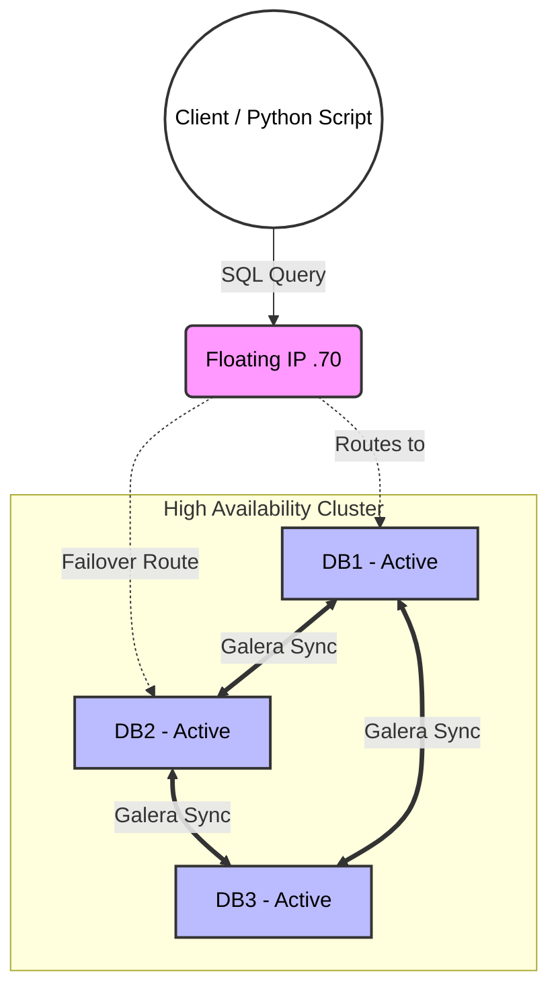
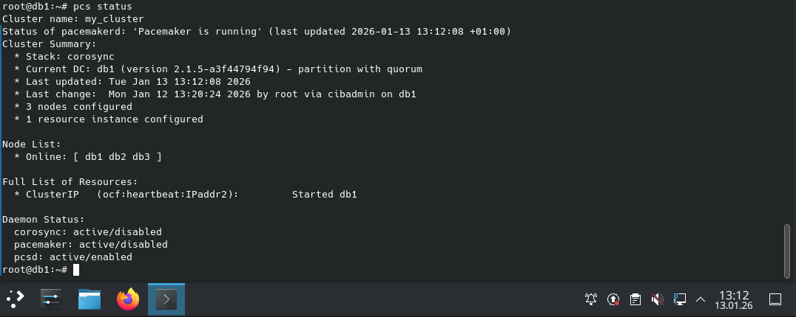

# High-Availability Distributed Data Infrastructure

A fault-tolerant, active-active database cluster designed for zero-downtime Machine Learning pipelines.

This project engineers the reliability layer required for production-grade Feature Stores and Model Serving endpoints. It moves beyond "works on my machine" to "survives hardware failure," using industry-standard Linux automation to guarantee data persistence during catastrophic node loss.

## 🏗 Architecture

The system uses a 3-node mesh topology to ensure consistency and availability.



### The Stack

- **OS:** Debian GNU/Linux 12 (Bookworm)
  - *Kernel:* Linux 6.1.0-31-amd64 (LTS)

- **Database:** MariaDB Server 10.11.14 (LTS)
  - *Replication Provider:* Galera Cluster 4 (v26.4.23)
  - *Configuration:* Synchronous Multi-Master, Row-Based Replication

- **Orchestration:** High-Availability Cluster Stack
  - *Manager:* Pacemaker 2.1.5
  - *Messaging:* Corosync 3.1.7
  - *Configuration Tool:* PCS 0.11.5

- **Routing:** Floating Virtual IP (VIP) via IPaddr2
  - *Mechanism:* Gratuitous ARP broadcast for <2s failover

## 🔧 Engineering Challenges Solved

### 1. The "Split-Brain" Problem

In distributed systems, a network partition can cause two nodes to believe they are both the "Master," leading to data corruption.

**Solution:** Implemented a Quorum Consensus algorithm. The cluster requires a strict majority (2/3 votes) to remain active. If a node becomes isolated, it automatically fences itself (stops accepting writes) to preserve data integrity.

### 2. Zero-Downtime Failover

Standard database failover often requires manual intervention or complex DNS changes.

**Solution:** Configured Pacemaker resource constraints to automate the promotion of standby nodes.

**Result:** Mean Time To Recovery (MTTR) reduced to <2 seconds. The Floating IP migrates automatically, making the failure transparent to downstream ML applications.

### 3. Verification as Code

Infrastructure reliability is theoretical until tested.

**Solution:** Built a custom Python Chaos Monitor (`tests/chaos_monitor.py`) that continuously polls the cluster while injecting faults (killing nodes), logging the exact duration of service interruption for SLA verification.

## 📂 Repository Structure

``` plaintext
.
├── README.md                            # This file
├── configs/
│   ├── pcs_commands.sh                 # Infrastructure-as-Code reconstruction script
│   ├── mariadb/
│   │   └── 50-server.cnf               # MariaDB server-specific tuning
│   ├── network/
│   │   └── interfaces_example.txt      # Static IP configuration example
│   └── pacemaker/
│       └── pcs_config_dump.txt         # Full Pacemaker cluster configuration
├── diagrams/
│   └── architecture.mmd                # System visualization (Mermaid diagram)
├── evidence/
│   ├── failover_log.txt                # Raw logs proving failover speed (<2s MTTR)
│   ├── cluster_status.png              # Snapshot of converged cluster state
│   └── failover_demo.png               # Evidence of automatic failover execution
├── tests/
│   ├── chaos_monitor.py                # Python script for SLA verification & downtime measurement
│   └── requirements.txt                # Python dependencies for chaos testing
└── scripts/
    └── LIVE_DEMO_COMMANDS.md           # Reference guide for live demo testing workflow
```

## 🚀 Reproduction Steps

### 1. Infrastructure Provisioning

Provision 3 Linux nodes with static IPs in a private subnet (e.g., 192.168.205.x). Ensure low-latency interconnects for Corosync heartbeats.

### 2. Bootstrap the Replication Layer

Initialize the Galera Primary component on Node 1.

```bash
# On Node 1
galera_new_cluster
# On Nodes 2 & 3
systemctl start mariadb
```

### 3. Orchestrate Resources

Apply the Pacemaker constraints to bind the Floating IP to the active database nodes.

```bash
./configs/pcs_commands.sh
```

### 4. Verify Reliability

Run the chaos monitor and simulate a node failure (e.g., `systemctl stop mariadb` or `echo c > /proc/sysrq-trigger`).

```bash
python3 tests/chaos_monitor.py
```

For interactive testing and manual verification steps, see [`scripts/LIVE_DEMO_COMMANDS.md`](scripts/LIVE_DEMO_COMMANDS.md).

## 📊 Performance Evidence

**Cluster Convergence State:**


**Failover Log (Chaos Test Results):**
Log excerpt showing connection recovery:

```plaintext
[14:02:10.450] [SUCCESS] Connected to db1
[14:02:12.100] [SUCCESS] Connected to db2  <-- Recovery
```
